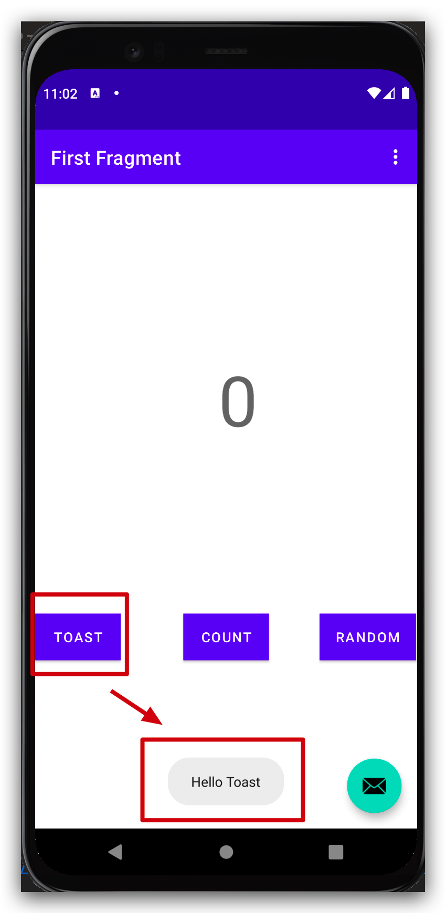
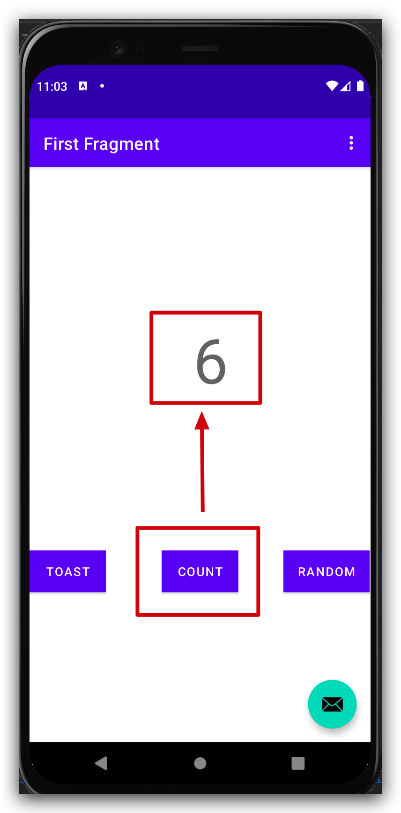
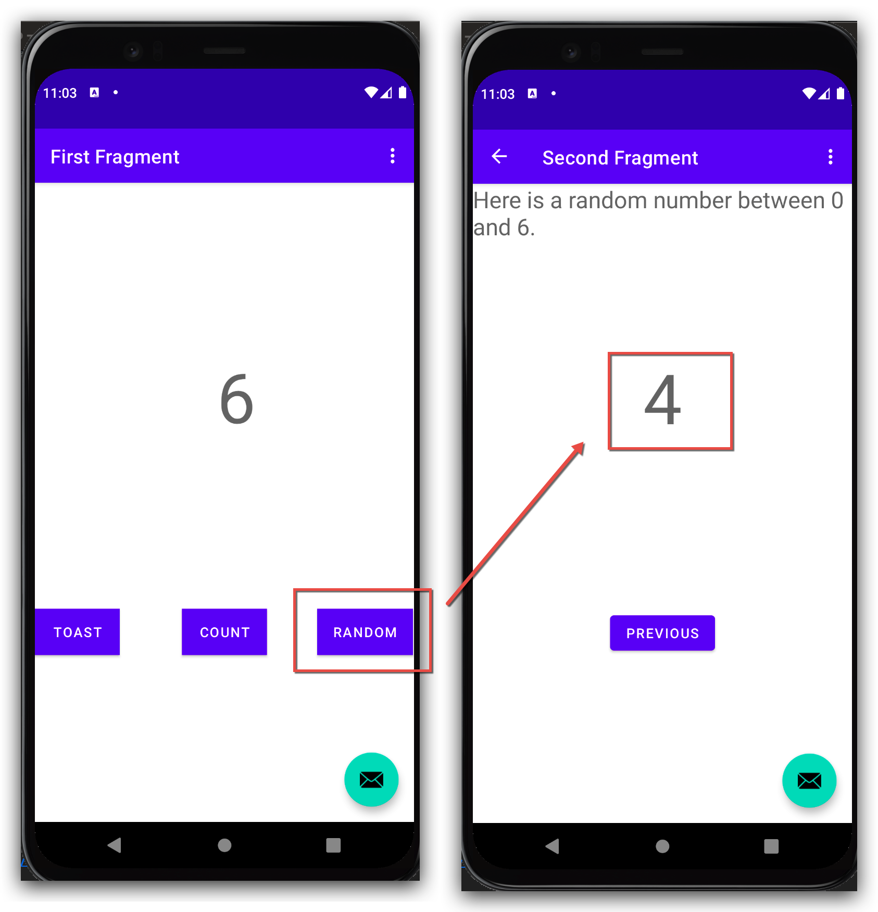

First Android App with Kotlin


#### Tutorial

tutorial: [Build Your First Android App in Kotlin](https://developer.android.com/codelabs/build-your-first-android-app-kotlin)

features

- toast: by clicking this button, toast message shows, and then dismisses in seconds.
- count: by clicking this button, integer increases from 0 by 1.
- random: show random integer between 0 and counted number.
    - counted number updated by clicking the "count" button
    - by clicking the "random" button, next page will show a random integer between 0 and counted number
    - this counted number was passed through navigated pages via "androidx.navigation.safeargs"
- http: with retrofit2, by clicking count button, send request to [httpbin.org](https://httpbin.org/)
    - [Android Networking With Kotlin Tutorial: Getting Started](https://www.raywenderlich.com/6994782-android-networking-with-kotlin-tutorial-getting-started)
    - [Retrofit](https://square.github.io/retrofit/)
    - [httpbin.org](https://httpbin.org/)


#### Screenshots

<p>
  
  
  
</p>

#### Development

build from command line

```shell
# list all tasks
./gradlew tasks

# build debug apk
./gradlew assemble

# apk path
ls -lh app/build/outputs/apk/debug
```

deploy to emulator

```shell
# ensure path in bash_profile/zshrc/...
# see https://stackoverflow.com/a/49511666/1448139
# e.g.:
export ANDROID_SDK=~/Library/Android/sdk
export PATH=${ANDROID_SDK}/emulator:${ANDROID_SDK}/tools:${ANDROID_SDK}/cmdline-tools/5.0/bin:${ANDROID_SDK}/platform-tools:$PATH

# list all emulators
emulator -list-avds

# start emulator
emulator -avd Pixel_5_API_30

# install use adb
adb install app/build/outputs/apk/debug/app-debug.apk
```


#### Issues

issue1: navigation-safe-args

- error: Type 'ArgumentsGenerationTask' property 'applicationId' is missing an input or output annotation.
- see: https://stackoverflow.com/a/67107330/1448139

issue2:
- error: Unresolved reference: SecondFragmentArgs
- see: https://github.com/google-developer-training/first-android-app/issues/80


#### Reference
- [Build your app from the command line](https://developer.android.com/studio/build/building-cmdline)
- [Build Your First Android App in Kotlin](https://developer.android.com/codelabs/build-your-first-android-app-kotlin)
- [GitHub Actions for Android developers](https://medium.com/google-developer-experts/github-actions-for-android-developers-6b54c8a32f55)
- [Android Networking With Kotlin Tutorial: Getting Started](https://www.raywenderlich.com/6994782-android-networking-with-kotlin-tutorial-getting-started)
- [Retrofit](https://square.github.io/retrofit/)
- [httpbin.org](https://httpbin.org/)
